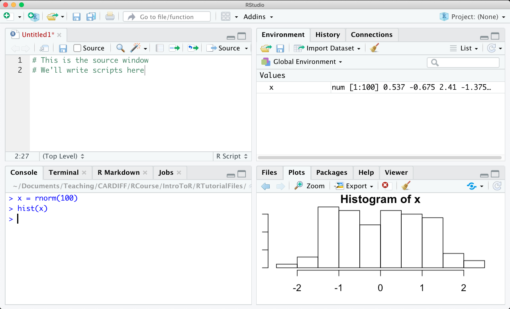
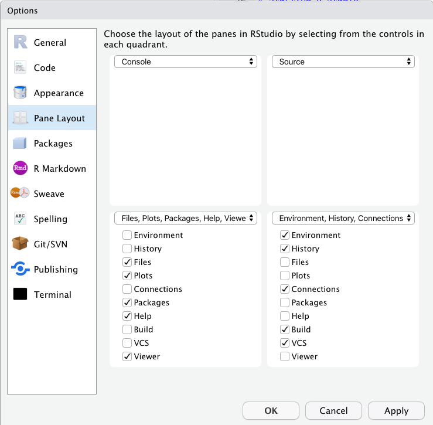
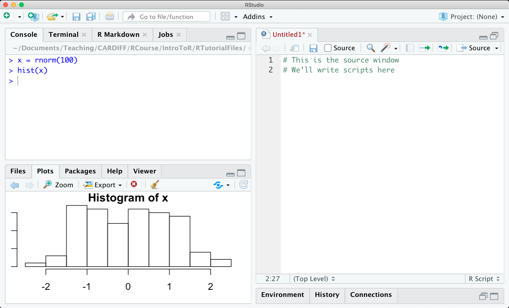

This is a short tutorial on how to use R.  

This format indicates that the text is R code:

```{r eval=F}
2 + 16
```

This format indicates that the text is the output of running some code:

```{r echo=F}
2 + 16
```

# Installation

First, you need to download and install R ([from here](http://ftp5.gwdg.de/pub/misc/cran/), I'm using version 3.2.2, but you should install the latest version, or at least check you have version 3 or above). This will install the R language and a basic interface for using R.

We'll also be using an advanced interface for R called RStudio. This also needs to be downloaded and installed (download it [here](https://www.rstudio.com/). Make sure you do this *after* installing R.

The installation should be as simple as downloading the installers and running them. Here are some Youtube videos that show you the process:

## Installing on Windows

<iframe width="560" height="315" src="https://www.youtube.com/embed/VLWaED9jTiA" frameborder="0" allowfullscreen></iframe>

## Installing on a Mac

<iframe width="560" height="315" src="https://www.youtube.com/embed/by5HyJX6H1I" frameborder="0" allowfullscreen></iframe>


# Starting R studio

When you have installed both R and RStudio, open Rstudio. The program looks something like this (the position of each window might be different for you):



In the bottom left is the console - you can type in R arguments here and press enter to run them. You can tell it's the console because there's an ">" symbol, waiting for you to give input.

On the top left is the script window. You can write R scripts - text files with lists of R code - here and them save them for later. You can pass lines of code from this script to the console by hilighting some text and pressing the "Run" button in the top right (or type Control+Enter on Windows, or Command+Enter on a Mac).

On the bottom right is a space for displaying plots and accessing the help files. On the top right there is a space for displaying what objects are in the memory at the moment. I don't tend to use this window much, so you can minimise it if you like.

For a basic introduction to the RStudio interface, you could check out a short youtube video like [this one](https://www.youtube.com/watch?v=5YmcEYTSN7k).


<iframe width="560" height="315" src="https://www.youtube.com/embed/5YmcEYTSN7k" frameborder="0" allowfullscreen></iframe>

# Getting comfortable

Make sure that the RStudio environment is comfortable for you. You could:

**Adjust the size of text**

-  Click on the menu View > Zoom in / Zoom out (or Command + "+" / Command + "-" key). I like to have quite large text.

**Adjust the colours**

-  Open the preferences (Windows: Tools > Global Settings; Mac: click "RStudio" in the top menu, then "Preferences")
-  Click "Appearance"
-  Change the "Editor theme" to one you like.
-  (Tip: "Solarised Dark" is the one that makes it look most like The Matrix).

**Adjust the position of the panes**

-  Open the preferences (Windows: Tools > Global Settings; Mac: click "RStudio" in the top menu, then "Preferences").
-  Click "Pane Layout".
-  Make the changes you want. I tend to maximise the space for viewing the script with the following setup:



So that it looks like this:




**FEEL like an AWESOME HACKER**

Please listen to either Yoko Kanno or your favourite Glitch Hop band.

<iframe width="560" height="315" src="https://www.youtube.com/embed/lBfYXE098bA" frameborder="0" allowfullscreen></iframe>


---------------

Go to the [next tutorial](IntroToR_1.html)

Back to the [index](../index.html)
